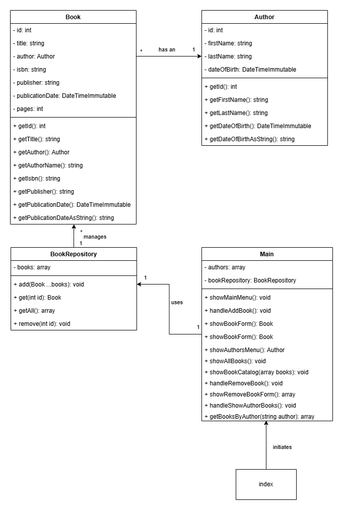

# Bibliotheek Systeem - Deel 2

Onderstaand is een klassendiagram:



Het bovenste gedeelte van een klasseblok zijn de properties en het onderste gedeelte zijn de methods/functies. Letop het `-` en `+` teken; `-` is voor "private" properties en functies, `+` voor public.

Het pijltje tussen de twee klasseblokken geeft de relatie aan. `*` houdt in dat die kant van de relatie vaker voor komt. De `1` betekent dat die kant van de relatie maar één keer voorkomt. Kortom: een auteur kan meerdere boeken hebben, maar een boek heeft maar één auteur. *In de praktijk kan het natuurlijk voorkomen dat een boek meerdere auteurs heeft, maar voor nu houden we het simpel*.

Letop: er zijn geen "setter" methodes, dus de properties mogen "readonly" zijn.


## Classes

Zoals je aan de klassendiagram kunt zien werken we voor `Book` niet meer met een array maar met een class. We hebben nog wel een array nodig om de `Book` objecten in te stoppen.

Naast de classes voor boek en auteur zijn er ook twee andere classes.

### Main
We maken zo min mogelijk gebruik van de "index.php", die gaan we alleen nog maar gebruiken om onze applicatie te "bootstrappen". We kunnen alle imports van de classes met `require_once` in de "index.php" zetten.

Het enige wat "index.php" daarnaast nog doet is een object aanmaken van de `Main` class.

Alle methodes die we eerder hadden in de "index.php" zijn dus verplaatst naar de `Main` class.

### BookRepository
In dit project gaan we gebruik maken van meerdere "Design Patterns". Dit zijn oplossingen voor het samenwerken van klassen en objecten die zichzelf al meerdere keren bewezen hebben.

De "Repository Pattern" is zo'n Design Pattern. Met het gebruik van deze pattern besteden we het beheren van onze data uit aan een aparte class, zodat als we iets moeten veranderen aan de logica voor het opslaan van onze objecten, dat alleen in de Repository class hoeft te gebeuren.

Voor nu beheren we alleen boeken, dus is de `BookRepository` voldoende. Deze class heeft dus alle functies voor het beheren van de `books` array.

Samengevat: de `Main` class raakt niet zelf de `books` array aan, dit gebeurt via de `BookRepository` class.

#### add(Book ...$books)
Ik wil wanneer dat kan zo min mogelijk functies toevoegen. Het liefst hergebruik ik een functie als dat kan.

Ik wil bij het toevoegen van een boek de mogelijkheid hebben om meerdere boeken in één keer toe te voegen. Dit kan met iets wat we `varargs` noemen.

```PHP
public function add(Book ...$books): void
{
    $this->books = array_merge($this->books, $books);
}
```

De `...` in de bovenstaande methode zetten alle meegegeven parameters om naar één array. Wat het mogelijk maakt om de `add` functie aan te roepen met meerdere boeken.

```PHP
$bookRepository = new BookRepository();
$bookRepository->add(new Book(/**/), new Book(/**/), new Book(/**/));
```

of met maar één boek.

```PHP
$bookRepository->add(new Book(/**/));
```

of met een array als we de "spread operator" gebruiken; dat is wanneer we de `...` gebruiken wanneer we een array aan een parameter meegeven. De spread operator splits een array op in individuele variabelen. Iets wat de `varargs` parameter dus nodig heeft.

```PHP
$books = [new Book(/**/), new Book(/**/), new Book(/**/), new Book(/**/)];
$bookRepository->add(...$books);
```

--------

De overige functies van de classes zijn redelijk straight forward. 

Maak de `Main` class aan en verhuis alle methodes uit de "index.php" daar naar toe en geef ze de juiste `access-modifiers`. Zorg ook dat ze de nieuwe `Book` en `Author` objecten kunnen gebruiken.

Verwijder de functies die uitbesteed zijn aan de `BookRepository` en wijzig de overige functies zo dat ze met de `BookRepository` samen kunnen werken.

## Use Cases
We breiden "Use Case 2" uit en voegen "Use Case 5" toe.

### Use Case 2: Toon alle boeken

**Primary Actor:** Eindgebruiker

**Preconditions:**
- De eindgebruiker heeft toegang tot het systeem.
- Er zijn al boeken beschikbaar in het systeem.

**Postconditions:**
- De lijst van alle boeken wordt getoond aan de eindgebruiker.

**Main Success Scenario:**
1. De eindgebruiker kiest de optie om alle boeken te tonen.
2. Het systeem haalt de lijst van alle boeken op.
3. Het systeem toont de lijst van alle boeken de titel en auteur.
4. Het systeem vraagt de gebruiker om een boek te kiezen om de details te tonen.
5. De eindgebruiker kiest een boek.
6. Het systeem gaat verder met "Use Case 4".

**Extensions:**
- 2a. Er zijn geen boeken beschikbaar in het systeem:
    - 1. Het systeem toont een melding dat er geen boeken beschikbaar zijn.
- 5a. De eindgebruiker kiest er voor om terug te gaan naar het hoofdmenu.
    - 1. Het systeem keert terug naar het hoofdmenu.
- 5b. De eindgebruiker kiest een niet-bestaand boek:
    - 1. Het systeem toont een foutmelding en vraagt de eindgebruiker om opnieuw een boek te selecteren.

-------

De volgende Use Case wordt toegevoegd:

### Use Case 5: Toon details van een boek

**Primary Actor:** Eindgebruiker

**Preconditions:**
- De eindgebruiker heeft toegang tot het systeem.
- Er zijn al boeken beschikbaar in het systeem.

**Postconditions:**
- De details van het geselecteerde boek worden getoond aan de eindgebruiker.
- Het geselecteerde boek kan worden verwijderd uit de bibliotheek.

**Main Success Scenario:**
1. De eindgebruiker kiest de optie om de details van een boek te tonen.
2. Het systeem toont de details van het geselecteerde boek (titel, auteur, ISBN, uitgever, publicatiedatum, aantal pagina's).

**Extensions:**
- 2a. De eindgebruiker kiest de optie om het boek te verwijderen.
- 1. Het systeem vraagt de eindgebruiker om de keuze te bevestigen.
- 2. De eindgebruiker bevestigt de keuze.
    - 2a. De eindgebruiker annuleert de verwijdering.
        - 1. Het systeem annuleert de verwijdering en keert terug naar de detailweergave van het boek.
- 3. Het systeem verwijdert het geselecteerde boek uit de lijst van boeken.
- 4. Het systeem keert terug naar het 'Toon Alle Boeken' menu en bevestigt dat het boek succesvol is verwijderd.

## Functies
Er komen een aantal functies bij in de `Main` class en er wijzigen een paar.

- Use Case 2: Toon alle boeken
 - Voeg aan `showAllBooks()` toe dat de eind gebruiker een index kan invoeren voor het tonen van boek details.
    - `showBookDetails()` - roept de `get()` methode aan op het `BookRepository` object, toont het boek en geeft de eind gebruiker de mogelijkheid om het boek te verwijderen.
        - `showRemoveBookDialogue()` wordt getoond wanneer de eind gebruiker kiest om een boek te verwijderen. Wanneer de eind gebruiker het verwijderen bevestigt wordt de `remove()` methode aan geroepen op het `BookRepository` object.

## Testen
Om het programmeren wat makkelijker te maken is het handig om testen te schrijven, zodat je niet een heel menu door hoeft om nieuwe functionaliteit te testen.

Wanneer je zover bent laat het mij dan weten. Het is makkelijker om te laten zien hoe je testen moet schrijven, dan het te beschrijven.