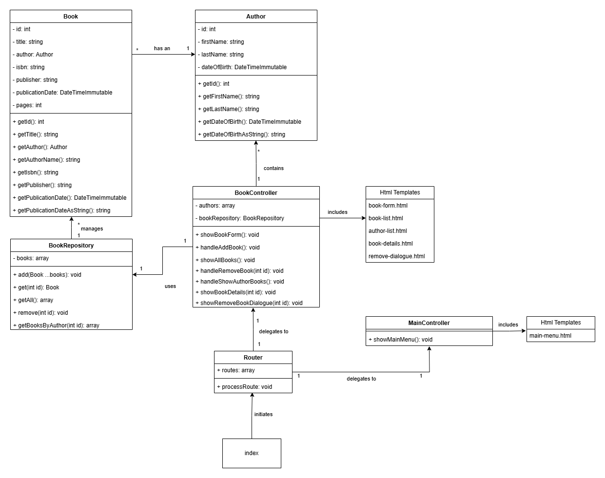

# Bibliotheek Systeem - Deel 3

## Wijzigingen in de Structuur van de Library System Applicatie

### 1. **Verwijdering van de `Main` Klasse**
In de oude structuur fungeerde de `Main` klasse als centrale toegangspunt voor de applicatie. Deze klasse bevatte methoden zoals `showMainMenu()`, `showAuthorsMenu()`, en `showBookCatalog()`, die verantwoordelijk waren voor het beheren van de gebruikersinteractie en het initiëren van acties.

In de nieuwe structuur is de `Main` klasse volledig verwijderd. Deze verantwoordelijkheden zijn nu verdeeld over twee nieuwe onderdelen:
- **`BookController`**: Beheert alle boekgerelateerde functies.
- **`MainController`**: Beheert het navigeren naar het hoofdmenu.

Deze wijziging zorgt voor een betere scheiding van verantwoordelijkheden en maakt het systeem beter schaalbaar en onderhoudbaar.

---

### 2. **Toevoeging van de `Router`**
In de nieuwe structuur speelt de `Router` een centrale rol in het verwerken van gebruikersverzoeken en het delegeren naar de juiste controller. De `Router` bevat:
- Een array van beschikbare routes.
- De methode `processRoute`, die verantwoordelijk is voor het koppelen van een route aan de bijbehorende controlleractie.

Dit vervangt de directe afhankelijkheid van de `Main` klasse in het oude systeem en zorgt voor een modulaire en uitbreidbare architectuur.

Hier is een korte uitleg van de gegeven Router-code:

---

#### Uitleg van de Router-code

[Router](./example/librarysystem/Router.php)

De `Router`-klasse illustreert hoe routing werkt in een webapplicatie. Hier zijn de belangrijkste aspecten:

1. **Routes Configuratie**:
   - De array `$routes` definieert de beschikbare routes in de applicatie.
   - Elke route bevat drie elementen:
     - Het HTTP-method (`get` of `post`).
     - Het pad (bijv. `book/:id` voor een specifiek boek-ID).
     - De actie (de controllerklasse en methode die de route behandelt).

2. **Constructor**:
   - De constructor haalt het pad op van de servervariabele `PATH_INFO` en splitst deze in delen (`$pathParts`).
   - Dit wordt gebruikt om het verzoek te matchen met een gedefinieerde route.

3. **`processRoute` Methode**:
   - Deze methode bepaalt welke controlleractie moet worden aangeroepen.
   - De router doorloopt alle gedefinieerde routes en vergelijkt het HTTP-method en het pad met de huidige aanvraag.
   - Bij een match wordt de corresponderende controlleractie aangeroepen, met een optionele parameter (bijvoorbeeld het boek-ID).
   - Als er geen match is, retourneert de methode een `404 Not Found`.

4. **`matchRoute` Methode**:
   - Vergelijkt het huidige pad met een routepad.
   - Controleert of de structuur (aantal segmenten) overeenkomt.
   - Herkent routeparameters (aangegeven met `:`) en beschouwt deze als flexibel.

---

### 3. **Opsplitsing van Controllers**
De verantwoordelijkheden van de oude `Main` klasse zijn opgesplitst in twee specifieke controllers:
- **`BookController`**:
  - Methoden:
    - `showBookForm()`
    - `handleAddBook()`
    - `showAllBooks()`
    - `handleRemoveBook(int id)`
    - `showBookDetails(int id)`
  - Beheert alle interacties met betrekking tot boeken en hun auteurs.
- **`MainController`**:
  - Methode:
    - `showMainMenu()`
  - Beheert het navigeren naar het hoofdmenu van de applicatie.

Deze scheiding zorgt voor een duidelijke afbakening van verantwoordelijkheden en maakt het systeem eenvoudiger te begrijpen.

---

### 4. **Gebruik van HTML-Templates**
In de nieuwe structuur zijn HTML-templates geïntroduceerd voor de gebruikersinterface. Deze vervangen de console-gebaseerde menu's en invoer van de oude structuur. Voorbeelden van templates zijn:
- `book-form.html`: Voor het toevoegen of bewerken van boeken.
- `book-list.html`: Voor het weergeven van een lijst met boeken.
- `author-list.html`: Voor het weergeven van een lijst met auteurs.
- `remove-dialogue.html`: Voor bevestigingsdialogen bij het verwijderen van boeken.

Door gebruik te maken van HTML-templates wordt de applicatie beter geschikt voor een webomgeving.

---

### 5. **Veranderingen in de Workflow**
De workflow in het nieuwe systeem verschilt aanzienlijk van de oude console-applicatie:
- **Oude Workflow**:
  - De `Main` klasse beheerde een continue hoofdloop die gebruikersinput verwerkte.
  - Acties werden direct uitgevoerd op basis van de console-invoer.
- **Nieuwe Workflow**:
  - Gebruikers maken verzoeken via formulieren en webpagina's.
  - De `Router` bepaalt de juiste controller en actie.
  - Controllers verwerken de logica en geven gegevens door aan de juiste HTML-template.

Deze nieuwe aanpak sluit beter aan bij moderne webtoepassingen en zorgt voor een meer gebruiksvriendelijke ervaring.

## Checklist
- Variabelen zijn in het engels geschreven.
- Variabelen zijn in camelCase.
- Naamgeving van de variabelen zijn duidelijk en beschrijvend.
- Elk code block (begint met `{` en eindigt met `}`) wordt voorgegaan door een regel commentaar.
- Comments zijn in het engels geschreven.
- De code is geformateerd aan de hand van de Google Java Style Guide.
- Een loop bevat alleen code dat ook echt herhaalt hoort te worden. Berekeningen of andere zware
  operaties die voor elke iteratie hetzelfde blijven, horen niet in een loop te staan.
- Declareer variabelen zo dicht mogelijk waar het gebruikt word.
- De code bevat geen/tot zeer weinig code duplicatie. (DRY: Don't Repeat Yourself)
- Methodes doen maar 1 ding. Als je merkt dat je methode meerdere dingen doet, splits deze dan op in meerdere methodes.
- Een methode heeft een zelf documenterende naam. Aan de naam van de methode is het direct duidelijk wat het doet.
- Een methode heeft een Javadoc commentaar boven de methode. Hierin staat wat de methode doet, en wat de parameters zijn.
- Een class heeft een Javadoc commentaar boven de class. Hierin staat waar de class voor verantwoordelijk is.
  Zodat het duidelijk is welke code in de class hoort.