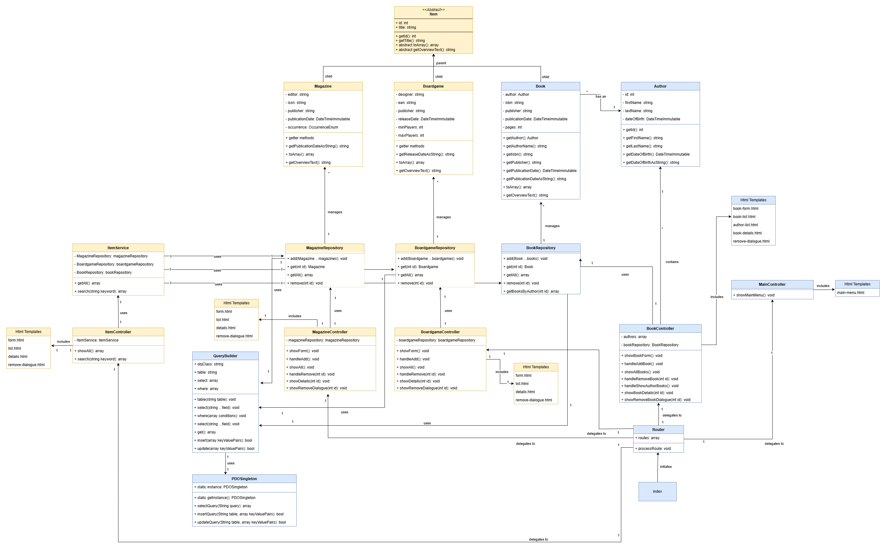

# Bibliotheek Systeem Deel 5

Zoals je aan de diagram kunt zien komen er twee nieuwe type items bij voor in de catalogus. Magazines en Boardgames. Voor elk type is een entity (Magazine en Boardgame), een controller, een repository en HTML templates.

## Item
We willen met progammeren zo min mogelijk code dupliceren. We zijn dan altijd opzoek naar hoe we functies kunnen schrijven die we kunnen hergebruiken. Maar we kunnen ook met behulp van inheritance properties en methods hergebruiken in classes. Dit doen we door te kijken naar welke methods en properties onze classes met elkaar gemeen hebben, en deze verplaatsen we dan naar een "parent" class waar de andere classes van overerven.

Bij het bibliotheek systeem is dat de class "Item" waar we de proprties "id" en "title" naar toe verplaatsen, omdat al onze items deze properties gemeen hebben.

### Abstract
Wat waarschijnlijk opvalt aan de class Item in de diagram is "<<Abstract>>". De class `Item` is dus een abstracte class,
dat wil twee dingen zegggen: je mag niet direct van de class `Item` een object maken, je mag er alleen van overerven; en de class heeft abstracte functies. 

Abstracte functies zijn functies die elk child van de parent class moet hebben, maar waarvan we in child class bepalen wat de functie precies doet. Abstracte functies hebben dus zelf geen functie body.

Dit doen we vaak voor usecases waar we polymorphisme voor willen toepassen.

### Polymorphisme
Een heel moeilijk woord, wat eigenlijk betekent "Een child mogen gebruiken op de plek van de parent". Als je een functie hebt die het object type `Item` accepteert, dan mogen de child classes (Magazine, Boardgame en Book) ook aan deze functie worden meegegeven.

Dit is erg handig, want hier kunnen we ook een hoop code mee hergebruiken. We kunnen namelijk onze database logica zo aanpassen dat deze objecten van het type `Item` accepteert, waar we dan alleen wel voor moeten zorgen is dat alle child types van `Item` de functies hebben die de database logica nodig heeft. 

En dit doen we middels een Abstracte class. De abstract class `Item` heeft een abstracte `toArray()` functie, die in alle child classes moet worden toegevoegd met een functie body. Deze `toArray()` functie kan gebruikt worden om het object type om te zetten naar een array om vervolgens op te slaan in de database.

### ItemService (& Controller)
Zoals je in de diagram kunt zien is er ook een `ItemController` en een `ItemService`, middels deze twee classes willen we een overzicht kunnen laten zien van alle object types en ook zoeken door alle object types heen. Omdat we alle object types al beheren middels eigen repositories, is het onzinnig om een ItemRepository aan te maken.

In plaats van een ItemRepository hebben we een class `ItemService`, de "Service" benaming geven we meestal aan een class waaraan we bepaalde logica uitbesteden die niet in een andere class past. In dit geval is de `ItemService` de class die ons toegang verleent tot alle beschikbare repositories, alle items ophaalt of door alle items heen zoekt, en het resultaat aan de `ItemController` teruggeeft om aan de eindgebruiker te laten zien.

In de `ItemController` class werken we met de class `Item`, alle resultaten die we terug krijgen worden in één dezelfde array gepropt. Dat houdt in dat we allen functies kunnen gebruiken die alle objecte gemeen hebben, anders gaat onze code stuk. Om een overzicht te kunnen maken waar bij we voor elke object type net iets andere informatie tonen is de functie `getOverviewText()` toegevoegd, we kunnen deze functie op elk `Item` object aanroepen, en in het child type aangeven wat deze functie voor text teruggeeft.

Letop: Hoewel het in de diagram onbreekt, is het handig om binnen elke repository een functie toe te voegen die het zoeken binnen die repository uitvoert. Deze functie kun je namelijk in de betreffende controller van het type object hergebruiken.

## Opdracht
1. Schrijf de volgende UseCases in de UseCase format:
    - UseCase 6: Toon alle tijdschriften
    - UseCase 7: Toon tijdschrijft details
    - UseCase 8: Tijdschrift verwijderen
    - UseCase 9: Toon alle boardgames
    - UseCase 10: Boardgame verwijderen
    - UseCase 11: Toon alle items
    - UseCase 12: Zoek door alle items op een bepaald trefwoord.
        - Voor alle item types zoek je door: "titel", "publisher"
        - Bij `Book` zoek je ook op "author"
        - Bij `Magazine` zoek je ook op "editor"
        - Bij `Boardgame` zoek je ook op "designer"
2. Maak de nodige classes aan voor de nieuwe Item types (Controllers, Repositories, Templates, Entities).
3. Maak de nodige classes aan voor het werken met alle Item types (ItemController, ItemService, Templates, Item).
4. Pas de database logica aan zodat het met "Item" objecten kan werken.
5. Werk de eerder geschreven UseCases uit.

## Checklist
- Variabelen zijn in het engels geschreven.
- Variabelen zijn in camelCase.
- Naamgeving van de variabelen zijn duidelijk en beschrijvend.
- Elk code block (begint met `{` en eindigt met `}`) wordt voorgegaan door een regel commentaar.
- Comments zijn in het engels geschreven.
- De code is geformateerd aan de hand van de Google Java Style Guide.
- Een loop bevat alleen code dat ook echt herhaalt hoort te worden. Berekeningen of andere zware
  operaties die voor elke iteratie hetzelfde blijven, horen niet in een loop te staan.
- Declareer variabelen zo dicht mogelijk waar het gebruikt word.
- De code bevat geen/tot zeer weinig code duplicatie. (DRY: Don't Repeat Yourself)
- Methodes doen maar 1 ding. Als je merkt dat je methode meerdere dingen doet, splits deze dan op in meerdere methodes.
- Een methode heeft een zelf documenterende naam. Aan de naam van de methode is het direct duidelijk wat het doet.
- Een methode heeft een Javadoc commentaar boven de methode. Hierin staat wat de methode doet, en wat de parameters zijn.
- Een class heeft een Javadoc commentaar boven de class. Hierin staat waar de class voor verantwoordelijk is.
  Zodat het duidelijk is welke code in de class hoort.