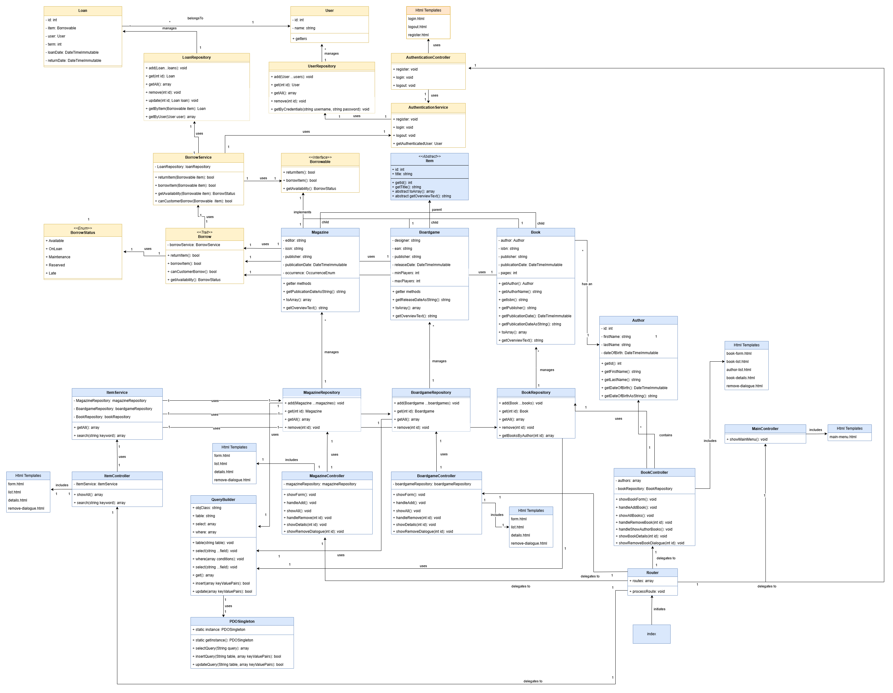

# Bibliotheek Systeem Deel 6

Tot nu toe hebben we aan een "bibliotheeksysteem" gewerkt zonder dat je daadwerkelijk items kunt lenen en terugbrengen. Dit gaan we nu toevoegen. Om dit werkend te krijgen is het ook nodig dat we met gebruikers gaan werken die een item kunnen lenen of terugbrengen.

## Nieuwe technieken

### Borrow Trait

### Borrowable Interface

### BorrowStatus Enum

## Checklist
- Variabelen zijn in het engels geschreven.
- Variabelen zijn in camelCase.
- Naamgeving van de variabelen zijn duidelijk en beschrijvend.
- Elk code block (begint met `{` en eindigt met `}`) wordt voorgegaan door een regel commentaar.
- Comments zijn in het engels geschreven.
- De code is geformateerd aan de hand van de Google Java Style Guide.
- Een loop bevat alleen code dat ook echt herhaalt hoort te worden. Berekeningen of andere zware
  operaties die voor elke iteratie hetzelfde blijven, horen niet in een loop te staan.
- Declareer variabelen zo dicht mogelijk waar het gebruikt word.
- De code bevat geen/tot zeer weinig code duplicatie. (DRY: Don't Repeat Yourself)
- Methodes doen maar 1 ding. Als je merkt dat je methode meerdere dingen doet, splits deze dan op in meerdere methodes.
- Een methode heeft een zelf documenterende naam. Aan de naam van de methode is het direct duidelijk wat het doet.
- Een methode heeft een Javadoc commentaar boven de methode. Hierin staat wat de methode doet, en wat de parameters zijn.
- Een class heeft een Javadoc commentaar boven de class. Hierin staat waar de class voor verantwoordelijk is.
  Zodat het duidelijk is welke code in de class hoort.