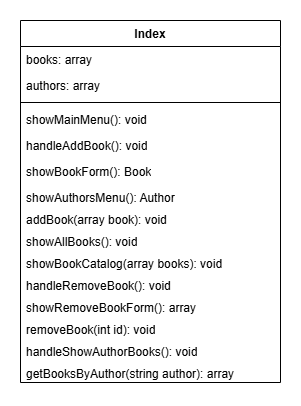

# Functions & Arrays: Building Reusable Code

Congratulations on mastering PHP fundamentals! Now you'll learn the concepts that transform scattered code into organized, professional applications. Functions and arrays are the building blocks that make complex programs manageable and efficient.

## 🔧 Prerequisites: Essential Skills You'll Need

Before diving into functions and arrays, you need to master these essential skills. Don't worry if you haven't seen them before—we'll teach them now, right when you need them!

### Essential String Functions

**Why Important**: You'll work with user input that needs to be checked and processed. These functions are your toolkit:

| Function | What It Does | Example Usage |
|----------|--------------|---------------|
| `strlen($text)` | Counts characters in a string | `strlen("hello")` returns `5` |
| `strpos($text, $char)` | Finds position of character | `strpos("hello", "e")` returns `1` |
| `trim($text)` | Removes extra spaces | `trim(" hello ")` returns `"hello"` |
| `ctype_alpha($text)` | Checks if only letters | `ctype_alpha("abc")` returns `true` |
| `strtolower($text)` | Converts to lowercase | `strtolower("HELLO")` returns `"hello"` |

**Try It Yourself**:
```php
<?php
$word = "Programming";
echo "Length: " . strlen($word) . "\n";           // Length: 11
echo "First 'r' at position: " . strpos($word, "r") . "\n";  // First 'r' at position: 1
echo "Lowercase: " . strtolower($word) . "\n";     // Lowercase: programming

$userInput = "  hello  ";
$cleaned = trim($userInput);
echo "Original: '" . $userInput . "'\n";          // Original: '  hello  '
echo "Cleaned: '" . $cleaned . "'\n";             // Cleaned: 'hello'
?>
```

### Input Validation Patterns

**The Problem**: Users don't always enter what you expect. Instead of your program crashing, teach it to handle problems gracefully.

**Basic Validation Concept**:
```php
<?php
do {
    $input = readline("Enter something: ");
    
    if (/* check if input is invalid */) {
        echo "Error message here\n";
        $isValid = false;
    } else {
        $isValid = true;
    }
} while (!$isValid);

echo "You entered: " . $input . "\n";
?>
```

**Key Validation Functions You'll Use**:
- `empty($input)` - Check if user entered nothing
- `is_numeric($input)` - Check if input is a number
- `ctype_alpha($input)` - Check if input contains only letters
- `strlen($input)` - Check input length

**Professional Pattern**: Always give clear error messages that tell users exactly what went wrong and what they should do instead.

**Why This Matters**: These patterns prevent your programs from breaking when users enter unexpected input. Professional applications always validate input!

### Understanding Variable Scope

**The Challenge**: When you start using functions, variables behave differently than they do in simple sequential programs.

**Local Variables** (What you're used to):
```php
<?php
$playerName = "Alice";      // This variable exists in the main program
$score = 100;               // This variable exists in the main program

if ($score > 50) {
    $message = "Well done!"; // This variable exists inside the if block
    echo $playerName . ": " . $message . "\n";  // Can access $playerName here
}

echo $message;  // This might cause an error! $message might not exist here
?>
```

**Preparing for Global Variables**:
```php
<?php
// These will be "global" variables that functions can access
$gameWords = ["apple", "banana", "cherry"];
$currentWord = "";
$guessedLetters = [];

// Imagine these variables need to be shared between different parts of your program
// You'll learn how functions can access these shared variables in this module
?>
```

**Key Understanding**: 
- Variables created inside `{...}` blocks might not be available outside those blocks
- Some variables need to be shared between different parts of your program
- Functions introduce new rules about which variables they can see

### Thinking in Reusable Components

**Current Approach**: You write everything in one long sequence
**Next Level**: Break your program into reusable pieces

**Identifying Patterns**: Look at programs you've written. Can you identify code that repeats or similar logic used in multiple places?

Common patterns you might find:
- Getting input from the user (and validating it)
- Displaying results or messages to the user
- Making decisions based on conditions
- Repeating actions until something happens

**Function Mindset**: Each repeating pattern could become a reusable function:
- `getUserInput()` - handles getting and validating user input
- `displayMessage()` - shows formatted output to users
- `checkCondition()` - evaluates game rules or business logic

**Why This Module Matters**: You'll learn to create these reusable components (functions) instead of copying and pasting the same code multiple times.

## 🎯 What You'll Learn

By the end of this module, you'll understand:

- **How to create functions** that make your code reusable and organized
- **Working with arrays** to manage collections of related data
- **Multi-dimensional arrays** for storing complex information structures
- **Global variables** and how they connect different parts of your program
- **Error handling** with exceptions to make your applications robust
- **Professional code organization** that other developers can easily understand

This module transforms your programming from writing scripts to building real applications with proper structure and organization.

## 📚 What You'll Master Step by Step

### Code Organization
- **Functions**: Creating reusable blocks of code that do specific tasks
- **Parameters & Return Values**: Passing information to functions and getting results back
- **Function Documentation**: Writing clear descriptions of what your functions do

### Data Management
- **Arrays**: Storing lists of related information (like shopping carts or game scores)
- **Multi-dimensional Arrays**: Arrays that contain other arrays (like storing multiple books with their details)
- **Array Functions**: Built-in PHP tools for searching, filtering, and organizing data

### Professional Practices
- **Code Reusability**: Writing functions once and using them many times
- **Error Handling**: Dealing with problems gracefully instead of crashing
- **Global Variables**: Sharing data between different functions when needed

## 📚 Learning Resources

**Your Main Textbook**: https://www.w3schools.com/php/default.asp

Study these specific sections to master functions and arrays:

| W3Schools Section | Why It's Important | What You'll Use It For |
|-------------------|-------------------|----------------------|
| **[PHP Functions](https://www.w3schools.com/php/php_functions.asp)** | Creating reusable code blocks | Organizing your code, eliminating repetition |
| **[PHP Strings](https://www.w3schools.com/php/php_string.asp)** | Working with text data | Processing words, letters, user input (builds on Prerequisites section) |
| **[PHP Arrays](https://www.w3schools.com/php/php_arrays.asp)** | Storing multiple values | Managing lists of books, users, scores |
| **[PHP Arrays - Indexed](https://www.w3schools.com/php/php_arrays_indexed.asp)** | Working with numbered lists | Simple collections like shopping lists |
| **[PHP Arrays - Associative](https://www.w3schools.com/php/php_arrays_associative.asp)** | Using named keys | Storing book details (title, author, ISBN) |
| **[PHP Arrays - Multidimensional](https://www.w3schools.com/php/php_arrays_multidimensional.asp)** | Arrays within arrays | Managing complete book catalogs |
| **[PHP Arrays - Create](https://www.w3schools.com/php/php_arrays_create.asp)** | Different ways to make arrays | Building your data structures |
| **[PHP Arrays - Access](https://www.w3schools.com/php/php_arrays_access.asp)** | Getting data from arrays | Retrieving book information |
| **[PHP Arrays - Update](https://www.w3schools.com/php/php_arrays_update.asp)** | Changing array values | Editing book details |
| **[PHP Arrays - Add Items](https://www.w3schools.com/php/php_arrays_add.asp)** | Adding new data to arrays | Adding books to your library |
| **[PHP Arrays - Remove Items](https://www.w3schools.com/php/php_arrays_remove.asp)** | Deleting data from arrays | Removing books from library |
| **[PHP Array Functions](https://www.w3schools.com/php/php_ref_array.asp)** | Built-in array tools | Searching, filtering, sorting collections |
| **[PHP Global Variables](https://www.w3schools.com/php/php_global.asp)** | Sharing data between functions | Accessing main data from helper functions |
| **[PHP Superglobals](https://www.w3schools.com/php/php_superglobals.asp)** | Special global variables | Advanced data sharing (preview for web development) |

**Learning Tip**: Focus on Functions and Arrays first—these are the most important concepts for building applications.

## 💻 Hands-On Learning

### Example: Enhanced Hangman Game
Location: [`example/hangman_v2.php`](example/hangman_v2.php)

This upgraded version of the hangman game demonstrates **how functions transform messy code into organized, professional applications**. The code shows:

**🔧 Function Organization & Reusability**:
- **9 specialized functions**, each with a single clear responsibility
- `handleMistake()` function reused by both `handleLetter()` and `handleWord()`
- `displayWord()` called repeatedly to show game progress
- `drawHangman()` provides visual feedback through ASCII art

**📊 Array & String Processing** (using skills from the Prerequisites section):
- **String functions**: `strlen()`, `strpos()`, `ctype_alpha()` for input processing
- **Input validation**: Professional error handling using the patterns you just learned
- **Array functions**: `count()` for array length, `in_array()` for searching, random array access
- **Multi-dimensional thinking**: `$guessedLetters` array tracks player progress

**🚨 Professional Error Handling**:
- **Try/catch blocks** to handle invalid input gracefully
- **Input validation** using `ctype_alpha()` to check for letters
- **Exception throwing** with meaningful error messages

**🎮 Advanced Programming Concepts**:
- **Global variables** (`$word`, `$guessedLetters`, `$attempts`, `$gameOver`) shared between functions
- **Switch statements** for complex conditional logic in `drawHangman()`
- **While loops** for game flow control
- **Function composition** - functions calling other functions to build complex behavior

**Key Learning Points**:
- **Before Functions**: All code mixed together in one long script (like hangman_v1.php)
- **After Functions**: Each piece has a specific job and can be reused
- **Real Array Usage**: See how arrays store game state and enable searching/tracking
- **Professional Exception Handling**: How to deal with user errors gracefully

### How to Use This Example
1. **First**: Study the W3Schools lessons on functions and arrays
2. **Then**: Compare hangman_v1.php with hangman_v2.php to see the transformation
3. **Finally**: Identify each function's single responsibility and how they work together

**Important Note About Exceptions**: In this educational example, we use exceptions to handle user input errors. In real applications, exceptions are typically reserved for serious programming errors (like database connection failures), not user input validation. This example shows the concept, but you'll learn better practices as you advance.

## 🏆 Your Programming Challenge

### Build a Personal Library Management System
Create a console application that manages a collection of books using functions and arrays.



**What Your System Should Do**:
1. **Add Books**: Let users add new books to the library
2. **View All Books**: Display the complete book catalog  
3. **Remove Books**: Allow users to delete books from the collection
4. **Search by Author**: Find all books by a specific author

**Technical Foundation**:
- **Multi-dimensional Array**: Store books as arrays within an array
- **Functions**: Each major feature gets its own function
- **Global Variables**: Share the book collection between functions
- **Array Filtering**: Use `array_filter()` to search by author

### Getting Started: Book Data Structure

Your library will use this data structure:

```php
// Global array of authors (simple array)
$authors = ["J.K. Rowling", "Stephen King", "Dan Brown"];

// Global array of books (multi-dimensional array)
$books = [
    [
        "title" => "Harry Potter",
        "author" => "J.K. Rowling", 
        "isbn" => "978-1234567890",
        "publisher" => "Bloomsbury",
        "publication_date" => "1997-06-26",
        "pages" => 320
    ]
    // More books will be added here...
];
```

### Core Features to Build

#### 1. Adding Books
- Show a numbered list of available authors
- Let the user choose an author by number
- Ask for book details (title, ISBN, publisher, date, pages)
- Add the complete book to your `$books` array

#### 2. Viewing All Books  
- Loop through your `$books` array
- Display each book's information in a readable format
- Handle the case where no books exist yet

#### 3. Removing Books
- Show a numbered list of all books
- Let the user choose which book to remove
- Delete the selected book from your `$books` array

#### 4. Searching by Author
- Show a list of authors
- Let the user select an author
- Use `array_filter()` to find all books by that author
- Display the filtered results

### Function Architecture (Recommended Structure)

**Main Menu Function**:
- `showMainMenu()` - Display options and route to appropriate functions

**Add Book Functions**:
- `handleAddBook()` - Coordinate the book addition process
- `showAuthorsMenu()` - Display authors and get user's choice
- `getBookDetails()` - Collect all book information from user
- `addBookToLibrary()` - Add the book data to your global array

**Display Functions**:
- `showAllBooks()` - Display the complete book catalog
- `displayBookList()` - Reusable function to show any array of books

**Remove Book Functions**:
- `handleRemoveBook()` - Coordinate the book removal process
- `removeBookFromLibrary()` - Actually delete the book from the array

**Search Functions**:
- `handleSearchByAuthor()` - Coordinate the search process
- `getBooksByAuthor()` - Filter books using `array_filter()`

## 📋 Understanding Use Cases

Before we dive into coding, let's learn about **Use Cases** - a professional way to describe what your application should do from the user's perspective. Use cases help you plan your functions before writing them!

### What is a Use Case?
A **Use Case** describes a specific goal a user wants to achieve with your application. Each use case becomes one or more functions in your code.

**Format**: "As a [user], I want to [do something] so that [I achieve a goal]"

### Our Library Management Use Cases

#### Use Case 1: Add a Book
**Goal**: User wants to add a new book to the library
**Main Success Scenario**:
1. User chooses "Add Book" from menu
2. System shows available authors
3. User selects an author
4. User enters book details (title, ISBN, publisher, etc.)
5. System adds the book to the library
6. System confirms success

**Extensions (What can go wrong?)**:
- **3a.** User selects invalid author number → Show error message and ask again
- **4a.** User enters empty title → Show error message and ask again
- **4b.** User enters duplicate ISBN → Show error message and ask for different ISBN

**Function**: `addBook()` - Takes book data and adds it to the books array

#### Use Case 2: View All Books
**Goal**: User wants to see what books are in the library
**Main Success Scenario**:
1. User chooses "Show All Books" from menu
2. System displays all books with their details
3. User can see the complete collection

**Extensions (What can go wrong?)**:
- **2a.** No books exist in library → Show "No books available yet. Add some books first!"

**Function**: `showAllBooks()` - Displays the complete book collection

#### Use Case 3: Remove a Book
**Goal**: User wants to remove a book from the library
**Main Success Scenario**:
1. User chooses "Remove Book" from menu
2. System shows current books
3. User selects which book to remove
4. System asks for confirmation
5. System removes the book
6. System confirms removal

**Extensions (What can go wrong?)**:
- **2a.** No books exist → Show "No books to remove" and return to menu
- **3a.** User selects invalid book number → Show error and ask again
- **4a.** User cancels confirmation → Cancel removal and return to menu

**Function**: `removeBook()` - Removes a book from the books array

#### Use Case 4: Find Books by Author
**Goal**: User wants to see books written by a specific author
**Main Success Scenario**:
1. User chooses "Books by Author" from menu
2. System shows available authors
3. User selects an author
4. System shows only books by that author
5. User sees filtered results

**Extensions (What can go wrong?)**:
- **2a.** No authors exist → Show "No authors available yet"
- **3a.** User selects invalid author → Show error and ask again
- **4a.** No books found for selected author → Show "No books found for [Author Name]"

**Function**: `getBooksByAuthor()` - Filters books array using `array_filter()`

### 💡 Why Use Cases Matter for Programmers

**Planning**: Use cases help you understand what functions you need before you start coding
**Testing**: Each use case gives you a clear way to test your functions
**Extensions Teach Defensive Programming**: The "what can go wrong" scenarios teach you to handle errors gracefully
**Communication**: Use cases help you explain your application to others
**Professional Skill**: Understanding user requirements and edge cases is essential in professional development

### 🚨 Why Extensions (Error Handling) Are Critical

Real applications must handle errors gracefully. The extensions in each use case teach you:

- **Input Validation**: Check if user input is valid before using it
- **Graceful Degradation**: What to do when expected data doesn't exist
- **User Experience**: How to guide users when something goes wrong
- **Defensive Programming**: Always plan for the unexpected

**Example**: Instead of your program crashing when no books exist, show a helpful message like "No books available yet. Add some books first!"

### Tips for Success

**Start Small**: Begin with just the main menu and one use case (like viewing books). Add features one at a time.

**Test Each Use Case**: After implementing a use case, test it thoroughly before moving to the next one.

**Use Functions Properly**: Each use case typically needs its own main function, plus helper functions for common tasks.

**Handle Edge Cases**: What happens when there are no books? Or invalid user input? Plan for these scenarios.

**Global Variables**: Use `global $books, $authors;` at the start of functions that need to access your main data arrays.

**Quality Checklist** (Focus on good habits from the beginning!):

**Function Design**:
- [ ] Each function has a single, clear purpose
- [ ] Function names clearly describe what they do: `addBookToLibrary()` not `doStuff()`
- [ ] Functions have proper PHPDoc comments explaining their purpose
- [ ] Functions return values when appropriate instead of just printing

**Code Organization**:
- [ ] All variable names are in English and use camelCase
- [ ] Each code block `{...}` has a comment explaining its purpose
- [ ] No code duplication - if you copy/paste, create a function instead
- [ ] Variables are declared close to where they're used

**Array & Data Management**:
- [ ] Use associative arrays with clear key names
- [ ] Validate user input before adding to arrays
- [ ] Handle edge cases (empty arrays, invalid selections)
- [ ] Use appropriate array functions (`array_filter`, `count`, etc.)

## 🎆 How You'll Know You're Ready to Move On

You've mastered functions and arrays when you can:

- [ ] **Create functions** that take parameters and return useful values
- [ ] **Organize code logically** with each function having a single responsibility  
- [ ] **Work with multi-dimensional arrays** to store complex data
- [ ] **Use global variables appropriately** to share data between functions
- [ ] **Filter and search arrays** using built-in PHP functions
- [ ] **Handle user input validation** within your functions
- [ ] **Debug function interactions** when data flows between multiple functions

**Remember**: This module is about learning to think in terms of reusable components. Every function you write should be clear enough that another programmer could use it immediately.

## 💡 Professional Development Tips

**Think in Components**: When planning your application, ask "What specific tasks do I need to accomplish?" Each task becomes a function.

**Document Your Functions**: Write a brief comment above each function explaining what it does, what parameters it needs, and what it returns.

**Test Individual Functions**: Before connecting functions together, make sure each one works correctly on its own.

**Embrace Refactoring**: As your application grows, you'll discover opportunities to create new functions or improve existing ones. This is normal and good!


## ➡️ What's Next?

After mastering functions and arrays, you'll advance to [04 - OOP 1](../04%20-%20OOP%201/) where you'll learn Object-Oriented Programming—the next evolution in organizing and structuring your code for even larger applications.

**Remember**: Functions and arrays are fundamental building blocks used in every PHP application. The patterns you learn here will serve you throughout your entire programming career.
