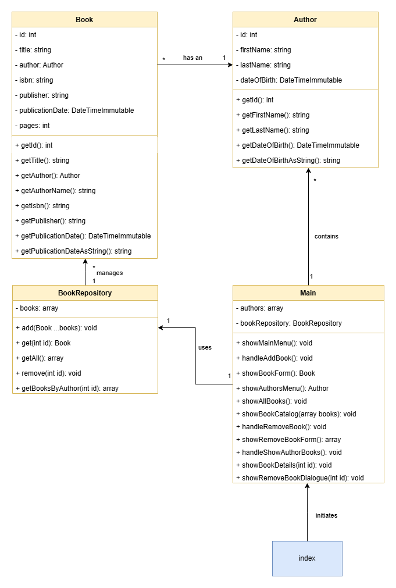

# 🏛️ Library Management System - Object-Oriented Programming

## 🎯 Assignment Overview

In this assignment, you'll build a **professional library management system** using Object-Oriented Programming (OOP). This project demonstrates how OOP transforms the procedural library system from Module 03 into a scalable, maintainable application that follows industry best practices.

**What You're Building**: A console-based library system where librarians can manage books using proper OOP design patterns and professional code organization.

## 📊 System Architecture

Your library system consists of these essential classes:



### Understanding Class Diagrams

**Class Diagram Reading Guide**:
- **Top Section**: Properties (data the class stores)
- **Bottom Section**: Methods (actions the class can perform)
- **Symbols**: `-` = private (internal use only), `+` = public (accessible from outside)
- **Relationships**: Arrow shows connection between classes
- **Multiplicity**: `1` = one instance, `*` = multiple instances

**Relationship Explanation**: One author can write multiple books (`*`), but each book has only one author (`1`). *Note: Real books can have multiple authors, but we're keeping this simple for learning purposes.*

**Important Design Decision**: Notice there are no "setter" methods in the diagram. This means properties should be **readonly** after creation—a professional practice that prevents accidental data corruption.

### Core Classes Overview

#### 1. 📖 Book Class (Entity)
Represents a single book in the library with all its essential information.

**Properties (Private - Encapsulation)**:
- `id` (int): Unique identifier for database-style management
- `title` (string): Book title
- `author` (string): Author name
- `isbn` (string): International Standard Book Number
- `publisher` (string): Publishing company
- `publication_date` (string): Publication date
- `pages` (int): Number of pages

**Methods (Public Interface)**:
- `__construct()`: Creates a new Book object with all required data
- **Getters**: `getId()`, `getTitle()`, `getAuthor()`, `getIsbn()`, `getPublisher()`, `getPublicationDate()`, `getPages()`

#### 2. 👤 Author Class (Entity)
Represents an author with their information.

**Properties (Private)**:
- `id` (int): Unique author identifier
- `name` (string): Author's full name

**Methods (Public)**:
- `__construct()`: Creates a new Author object
- `getId()`, `getName()`: Getter methods

#### 3. 🏗️ Main Class (Application Controller)
Orchestrates the entire application and handles user interaction.

**Purpose**: Manages the application flow without directly touching data arrays. All data operations go through the Repository.

**Key Principle**: The Main class doesn't manipulate the `books` array directly—it delegates all data operations to the `BookRepository` class. This is **Separation of Concerns** in action.

#### 4. 🗃️ BookRepository Class (Data Management)
Manages the collection of books and provides all data operations using the **Repository Pattern**.

**Properties**:
- `books` (array): Collection of Book objects
- Static ID counter for auto-incrementing book IDs

**Methods**:
- `__construct()`: Initializes empty repository
- `add(Book ...$books)`: Adds one or more books to the collection
- `getAll()`: Returns all books in the library
- `get(int $id)`: Finds a specific book by its ID
- `remove(int $id)`: Removes a book from the collection

## 🏗️ Understanding the Repository Pattern

The **Repository Pattern** is a professional design pattern that separates **data storage logic** from **business logic**. This is a crucial concept in enterprise application development.

### Why Use Repository Pattern?

**In Your Library System**:
- **Book Class**: Focuses solely on representing book data (Single Responsibility Principle)
- **BookRepository Class**: Handles all storage, retrieval, and management operations
- **Main Class**: Orchestrates user interactions without knowing how data is stored
- **Separation of Concerns**: Each class has a single, clear responsibility

### Professional Benefits:
- **📚 Maintainability**: Changes to data storage don't affect Book objects or Main class
- **🔄 Reusability**: Repository can be used by multiple controllers or services
- **🧪 Testability**: Easy to create mock repositories for testing
- **📈 Scalability**: Can easily switch from arrays to databases later

**Real-World Example**: In a professional application, you might switch from storing books in arrays to storing them in a MySQL database. With the Repository Pattern, you only change the BookRepository class—the Book class and your application logic remain unchanged.

## 🔧 Advanced PHP Concepts

### Variable Arguments (Varargs)
PHP supports **variable arguments**, allowing functions to accept unlimited parameters. This is useful for flexible methods that can handle multiple items at once.

```php
// Repository method using varargs
public function add(Book ...$books): void
{
    // The ...$books converts all passed Book objects into an array
    $this->books = array_merge($this->books, $books);
}
```

**Usage Examples**:

```php
$repository = new BookRepository();

// Add multiple books at once
$repository->add(new Book(/**/), new Book(/**/), new Book(/**/));

// Add a single book
$repository->add(new Book(/**/));

// Add from an array using spread operator
$bookArray = [new Book(/**/), new Book(/**/), new Book(/**/)];
$repository->add(...$bookArray); // Spreads array into individual arguments
```

**Key Concept**: The `...` operator works both ways:
- **In method parameters**: Collects multiple arguments into an array (varargs)
- **When calling methods**: Spreads an array into individual arguments (spread operator)

## 🆔 Auto-Incrementing ID Patterns

For professional data management, you need unique IDs for each book. Here's the recommended pattern using **static properties**:

```php
class Author {
    private static int $count = 0;  // Shared across ALL Author objects
    private int $id;                // Unique to each Author instance

    public function __construct(string $name) {
        $this->id = ++static::$count;  // Each new Author gets the next ID
        $this->name = $name;
    }
}
```

**How This Works**:
- **Static Property**: `$count` is shared by all Author objects (not per instance)
- **Automatic Increment**: Each new Author automatically gets the next available ID
- **No Duplicates**: Guaranteed unique IDs without manual management

**Professional Advantage**: This pattern ensures data integrity and follows the "Don't Repeat Yourself" (DRY) principle.

## 🚀 Implementation Strategy

### Step 1: Migrate from index.php to Main Class
**Professional Practice**: Keep your entry point (`index.php`) minimal. It should only:
1. Load required classes with `require_once` statements
2. Create a Main object and start the application

**All your previous functions** from the procedural version should move to the `Main` class with proper access modifiers.

### Step 2: Implement Repository Pattern
**Data Responsibility Transfer**: 
- Remove direct array manipulation from Main class
- All data operations go through BookRepository
- Main class focuses on user interaction and application flow

### Step 3: Convert Data Structures
**From Arrays to Objects**: Transform your associative arrays into proper Book and Author objects with type safety and encapsulation.

## 📋 Enhanced Use Cases

### Use Case 2: Display All Books (Enhanced)

**Goal**: User wants to see all books and optionally view detailed information about a specific book

**Main Success Scenario**:
1. User chooses "Show All Books" from the main menu
2. System retrieves all books from BookRepository
3. System displays list showing only **title and author** for readability
4. System prompts user to select a book for detailed view or return to menu
5. User selects a book by entering its number
6. System proceeds to **Use Case 5: Show Book Details**

**Extensions (Error Handling)**:
- **2a.** No books exist in the system:
  - System displays "No books available yet. Add some books first!"
  - System returns to main menu
- **5a.** User chooses to return to main menu:
  - System returns to main menu without showing details
- **5b.** User enters invalid book number:
  - System shows error message "Invalid selection. Please try again."
  - System re-prompts for valid book selection

### Use Case 5: Show Book Details (New)

**Goal**: User wants to see complete information about a specific book and optionally remove it

**Main Success Scenario**:
1. User selects a book from the books list
2. System displays complete book details (title, author, ISBN, publisher, publication date, pages)
3. System offers option to remove the book or return to book list
4. User makes selection

**Extensions (Error Handling)**:
- **3a.** User chooses to remove the book:
  1. System displays confirmation dialog: "Are you sure you want to remove '[Book Title]'? (y/n)"
  2. User confirms removal
  3. System removes book from repository using `remove()` method
  4. System displays success message: "Book '[Book Title]' has been removed successfully"
  5. System returns to "Show All Books" view
- **3a.2a.** User cancels removal:
  - System cancels operation and returns to book details view

## 🛠️ Required Functions

### Main Class Functions

**Core Navigation**:
- `showMainMenu()`: Display main application menu
- `showAllBooks()`: Enhanced to include book selection for details

**New Functions**:
- `showBookDetails(int $bookId)`: 
  - Calls `BookRepository->get($bookId)` to retrieve book
  - Displays complete book information
  - Offers removal option
- `showRemoveBookDialogue(Book $book)`: 
  - Confirms user intent to delete
  - Calls `BookRepository->remove($bookId)` if confirmed
  - Provides user feedback

**Repository Integration**: All functions that previously manipulated the `$books` array directly must now use BookRepository methods.

## 🧪 Testing Strategy

**Why Testing Matters**: Instead of manually navigating through menus every time you make a change, write tests to verify your functionality automatically.

**When to Test**: Once you've implemented your basic structure, we'll cover how to write proper tests. Testing is easier to demonstrate than to describe in text.

**Professional Benefit**: Tests allow you to confidently make changes and immediately verify that everything still works correctly.

## 📋 Quality Checklist

**Code Organization & Naming**:
- [ ] All variable names are in English and use camelCase
- [ ] All class names use PascalCase (BookRepository, not bookRepository)
- [ ] Method names clearly describe their purpose: `showBookDetails()` not `showStuff()`
- [ ] Each code block `{...}` has a comment explaining its purpose

**Object-Oriented Principles**:
- [ ] Each class has a single, clear responsibility
- [ ] Properties are private with public getters/setters only when needed
- [ ] Constructor properly initializes all required properties
- [ ] Static properties used correctly for shared data (like ID counters)

**Repository Pattern Implementation**:
- [ ] Main class never directly manipulates the `$books` array
- [ ] All data operations go through BookRepository methods
- [ ] Repository methods have clear names (`add()`, `get()`, `remove()`, `getAll()`)
- [ ] Proper separation between data management and user interface

**Professional Documentation**:
- [ ] Each class has a PHPDoc comment explaining its responsibility
- [ ] Each method has a PHPDoc comment describing its purpose and parameters
- [ ] Code follows consistent formatting standards
- [ ] No code duplication (DRY: Don't Repeat Yourself)

**Error Handling & User Experience**:
- [ ] Graceful handling of empty data (no books, invalid selections)
- [ ] Clear user feedback for all actions
- [ ] Confirmation dialogs for destructive actions (like removing books)
- [ ] Input validation with helpful error messages

**Advanced Concepts**:
- [ ] Proper use of varargs in repository `add()` method
- [ ] Auto-incrementing IDs implemented with static properties
- [ ] Understanding and implementation of Repository Pattern
- [ ] Encapsulation principles followed (private properties, public interface)

## 🎆 How You'll Know You're Ready to Move On

You've mastered Object-Oriented Programming basics when you can:

- [ ] **Create classes** with proper encapsulation (private properties, public methods)
- [ ] **Implement design patterns** like Repository for professional data management
- [ ] **Use constructors effectively** with auto-incrementing IDs and proper initialization
- [ ] **Apply separation of concerns** so each class has a single responsibility
- [ ] **Handle object relationships** between Books, Authors, and Repository
- [ ] **Write professional documentation** with clear PHPDoc comments
- [ ] **Debug object interactions** when data flows between classes

**Remember**: This module is about learning to think in terms of objects and responsibilities rather than just functions and data. Every class you create should have a clear purpose that you can explain in one sentence.

## 💡 Professional Development Tips

**Think in Objects**: When planning your application, ask "What real-world things am I modeling?" Each thing becomes a class.

**Single Responsibility**: Each class should have only one reason to change. If you're tempted to add unrelated functionality, create a new class.

**Documentation First**: Before writing a class, write a comment explaining what it's responsible for. This clarifies your thinking.

**Test Early**: Once you have basic functionality, write tests to verify it works. This makes debugging much easier.

## ➡️ What's Next?

After mastering basic OOP concepts, you'll advance to [05 - HTML & Forms & Sessions](../05%20-%20HTML%20&%20Forms%20&%20Sessions/) where you'll learn to build web interfaces for your object-oriented applications and handle user sessions.

**Remember**: Object-Oriented Programming is the foundation of modern PHP development. The patterns you learn here—encapsulation, separation of concerns, and design patterns—are used in every professional PHP framework including Laravel.
