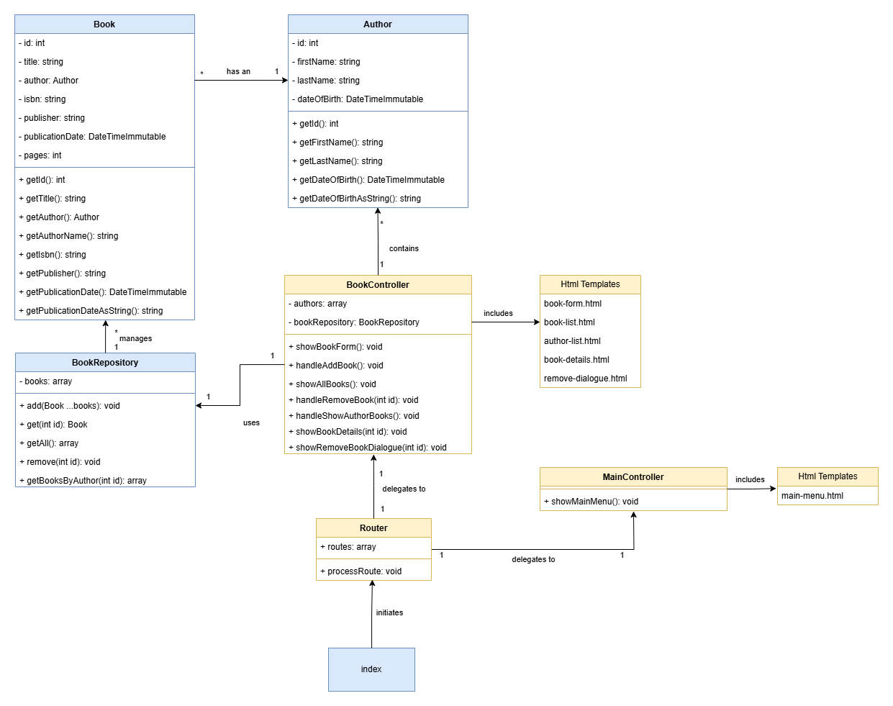

# 🌐 Library System - Web Application Evolution

## 🎯 Assignment Overview

**What You're Building**: Transform your console-based library system from Module 04 into a modern web application using HTML forms, session management, and the MVC (Model-View-Controller) architectural pattern.

**Why This Matters**: This evolution demonstrates how Object-Oriented Programming principles adapt to web development, teaching you the foundation patterns used in every modern PHP framework including Laravel.

## 🏗️ Architectural Evolution: From Console to Web

### 1. 🗂️ **Removal of the `Main` Class**
In the old structure, the `Main` class served as the central entry point for the application. This class contained methods such as `showMainMenu()`, `showAuthorsMenu()`, and `showBookCatalog()`, which were responsible for managing user interaction and initiating actions.

**Professional Evolution**: In the new structure, the `Main` class has been completely removed. These responsibilities are now divided across two new components:
- **`BookController`**: Manages all book-related functions and business logic
- **`MainController`**: Manages navigation to the main menu and application flow

**Why This Change Matters**: This separation follows the **Single Responsibility Principle** from professional software development, making the system more scalable and maintainable.

---

### 2. 🚦 **Addition of the `Router`**
In the new structure, the `Router` plays a central role in processing user requests and delegating to the appropriate controller. The `Router` contains:
- An array of available routes
- The `processRoute` method, which is responsible for linking a route to the corresponding controller action

**Professional Pattern**: This replaces the direct dependency on the `Main` class in the old system and provides a modular and extensible architecture. The Router pattern is fundamental to all modern web frameworks.

**Learning Objective**: Understanding routing is essential for web development—it's how applications determine what code to run based on the URL a user visits.

Here is a brief explanation of the given Router code:

---

#### 🔍 Explanation of the Router Code

[Router](./example/librarysystem/Router.php)

**Professional Implementation**: The `Router` class illustrates how routing works in a web application. This is the same pattern used by Laravel, Symfony, and other professional frameworks. Here are the key aspects:

1. **Routes Configuration**:
   - The array `$routes` defines the available routes in the application.
   - Each route contains three elements:
     - The HTTP method (`get` or `post`).
     - The path (e.g., `book/:id` for a specific book ID).
     - The action (the controller class and method that handles the route).

2. **Constructor**:
   - The constructor retrieves the path from the server variable `PATH_INFO` and splits it into parts (`$pathParts`).
   - This is used to match the request with a defined route.

3. **`processRoute` Method**:
   - This method determines which controller action should be called.
   - The router loops through all defined routes and compares the HTTP method and path with the current request.
   - On a match, the corresponding controller action is called, with an optional parameter (e.g., the book ID).
   - If there is no match, the method returns a `404 Not Found`.

4. **`matchRoute` Method**:
   - Compares the current path with a route path.
   - Checks if the structure (number of segments) matches.
   - Recognizes route parameters (indicated with `:`) and considers them as flexible.

---

### 3. 🎮 **Separation of Controllers**
**MVC Architecture**: The responsibilities of the old `Main` class have been split into two specific controllers, following the **Controller** part of the Model-View-Controller pattern:

- **`BookController`** (Business Logic Controller):
  - Methods:
    - `showBookForm()`
    - `handleAddBook()`
    - `showAllBooks()`
    - `handleRemoveBook(int id)`
    - `showBookDetails(int id)`
  - **Purpose**: Manages all interactions related to books and their authors

- **`MainController`** (Navigation Controller):
  - Method:
    - `showMainMenu()`
  - **Purpose**: Manages navigation to the main menu of the application

**Professional Benefit**: This separation provides a clear delineation of responsibilities and makes the system easier to understand, test, and maintain.

---

### 4. 🎨 **Use of HTML Templates**
**From Console to Web Interface**: In the new structure, HTML templates have been introduced for the user interface. These replace the console-based menus and input from the old structure, representing the **View** part of the MVC pattern.

**Template Examples**:
- `book-form.html`: For adding or editing books
- `book-list.html`: For displaying a list of books
- `author-list.html`: For displaying a list of authors
- `remove-dialogue.html`: For confirmation dialogs when removing books

**Professional Advantage**: By using HTML templates, the application becomes better suited for a web environment and provides a proper separation between presentation (HTML) and logic (PHP).

---

### 5. 🔄 **Changes in the Workflow**
**Request-Response Cycle**: The workflow in the new system differs significantly from the old console application, implementing the standard web application request-response cycle:

- **Old Console Workflow**:
  - The `Main` class managed a continuous main loop that processed user input
  - Actions were executed directly based on console input
  - Synchronous, single-user experience

- **New Web Workflow**:
  - Users make requests via forms and web pages
  - The `Router` determines the appropriate controller and action
  - Controllers process the logic and pass data to the appropriate HTML template
  - Stateless, multi-user capable

**Professional Context**: This new approach aligns with modern web applications and provides a more user-friendly experience. It's the same pattern used by all professional web frameworks.

## ✅ Professional Quality Checklist

**Code Organization & Naming**:
- [ ] Variables are written in English
- [ ] Variables are in camelCase
- [ ] Variable naming is clear and descriptive
- [ ] Each code block (starts with `{` and ends with `}`) is preceded by a line of comment
- [ ] Comments are written in English
- [ ] The code is formatted according to professional standards

**Performance & Best Practices**:
- [ ] A loop contains only code that actually needs to be repeated. Calculations or other heavy operations that remain the same for each iteration should not be in a loop
- [ ] Declare variables as close as possible to where they are used
- [ ] The code contains no/very little code duplication (DRY: Don't Repeat Yourself)

**Object-Oriented Design**:
- [ ] Methods do only 1 thing. If you notice that your method does multiple things, split it into multiple methods
- [ ] A method has a self-documenting name. From the method name it is immediately clear what it does
- [ ] A method has a PHPDoc comment above the method. This states what the method does, and what the parameters are
- [ ] A class has a PHPDoc comment above the class. This states what the class is responsible for, so that it is clear which code belongs in the class

**Web Development Standards**:
- [ ] Proper separation of concerns (MVC pattern)
- [ ] HTML templates separated from PHP logic
- [ ] Router handles all URL routing properly
- [ ] Controllers manage business logic without direct HTML output
